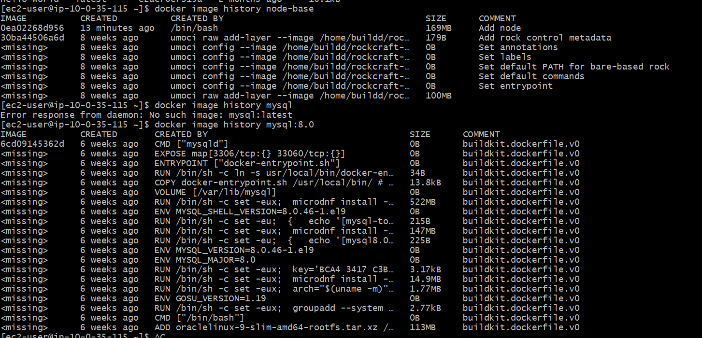

Docker image history
 
Some of the most common instructions in a Dockerfile include:

FROM <image> - this specifies the base image that the build will extend.
WORKDIR <path> - this instruction specifies the "working directory" or the path in the image where files will be copied and commands will be executed.
COPY <host-path> <image-path> - this instruction tells the builder to copy files from the host and put them into the container image.
RUN <command> - this instruction tells the builder to run the specified command.
ENV <name> <value> - this instruction sets an environment variable that a running container will use.
EXPOSE <port-number> - this instruction sets configuration on the image that indicates a port the image would like to expose.
USER <user-or-uid> - this instruction sets the default user for all subsequent instructions.
CMD ["<command>", "<arg1>"] - this instruction sets the default command a container using this image will run.

# Docker Network
bridge: Default driver for communication between containers on the same host.
host: Removes network isolation between the container and the host.
overlay: Connects containers across multiple Docker hosts (used in Swarm).
ipvlan and macvlan: Provide advanced control over network addressing and integration with physical networks.
none: Completely isolates the container from all networks.

# Multi Stage   
Multi-stage builds are recommended for all types of applications to optimize image size, security, and maintainability.

Docker Layer	Docker Image
A single filesystem change in an image	A collection of multiple layers
Smallest building block of an image	Complete package used to create containers
Read-only	Read-only
Created by Dockerfile instructions like RUN, COPY, ADD	Created by combining all layers
Cannot run independently	Can be used to start containers
Shared across images	Represents the final application image

# The main differences between ARG and ENV in Docker are:

Scope and Persistence:

ARG is only available during the build process. Its value is not persisted in the final image, so containers started from the image do not have access to ARG variables.
ENV is available during the build and is persisted in the final image. Containers started from the image will have access to ENV variables.
Configurability:

ARG can be set at build-time using the --build-arg flag with docker build.
ENV cannot be set at build-time directly. Its value must be declared in the Dockerfile, but you can combine ARG and ENV to allow ENV to be configured at build-time (e.g., ENV VAR=$ARG_VAR).
Usage:

Both can be used to parameterize builds, but ENV is primarily used to configure the runtime environment for containers, while ARG is used for build-time configuration.
Visibility:

Both are visible in the image history, so neither should be used for secrets.
Summary table:

Feature	ARG	ENV
Available during build	Yes	Yes
Available in containers	No	Yes
Settable at build-time	Yes (--build-arg)	No (unless combined with ARG)
Persisted in image	No	Yes

----------------------------------------
Namespaces & cgroups
Namespaces: Docker uses Linux kernel namespaces to provide isolation. Each container gets its own set of namespaces, which isolate processes, networking, and other resources. For example, each container has its own network stack, so it cannot access the sockets or interfaces of other containers or the host directly. This is the primary mechanism for container isolation.
cgroups: While not detailed in the retrieved documents, cgroups (control groups) are used by Docker to limit and prioritize resource usage (CPU, memory, etc.) for containers.
Sources:

https://docs.docker.com/engine/security/
https://docs.docker.com/get-started/docker-overview/
2. Docker Networking Internals
Bridge Networks & Overlay Networks
Bridge Network: The default network driver. When Docker Engine starts, it creates a "default bridge" network. Containers on the same host and bridge network can communicate as if they are on a physical Ethernet switch. Outbound connections (e.g., to the internet) are enabled by default using NAT (masquerading).
Overlay Network: Used to connect containers across multiple Docker hosts, typically in a Swarm setup. This removes the need for OS-level routing.
Network Drivers
bridge: Default, for container-to-container communication on the same host.
host: Removes network isolation; container uses the host’s network stack directly.
overlay: For multi-host networking.
ipvlan/macvlan: Advanced drivers for more control or legacy integration.
none: Completely isolates the container from all networks.
iptables
The knowledge base does not provide a detailed explanation of iptables, but Docker uses iptables rules to manage network traffic, NAT, and port mapping for containers.
Sources:

https://docs.docker.com/engine/network/
https://docs.docker.com/engine/network/drivers/
https://docs.docker.com/engine/security/
3. Storage Concepts
Volume vs Bind Mount
The knowledge base does not provide a direct comparison on this page. In general:
Volumes: Managed by Docker, stored in Docker’s storage area, and are the preferred mechanism for persistent data.
Bind Mounts: Map a file or directory from the host filesystem into the container.