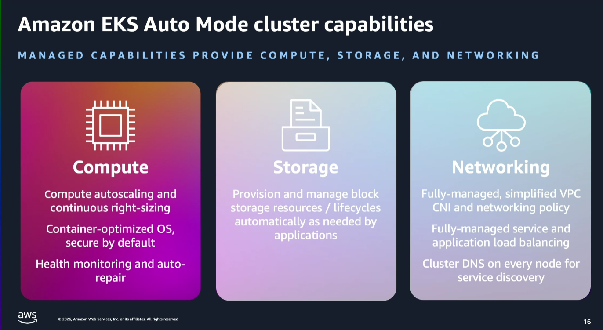

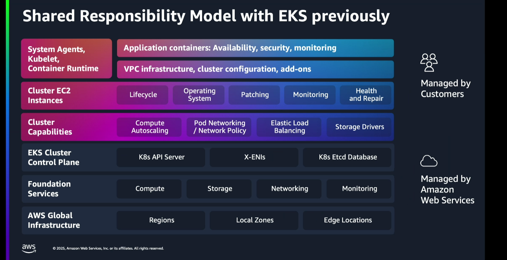

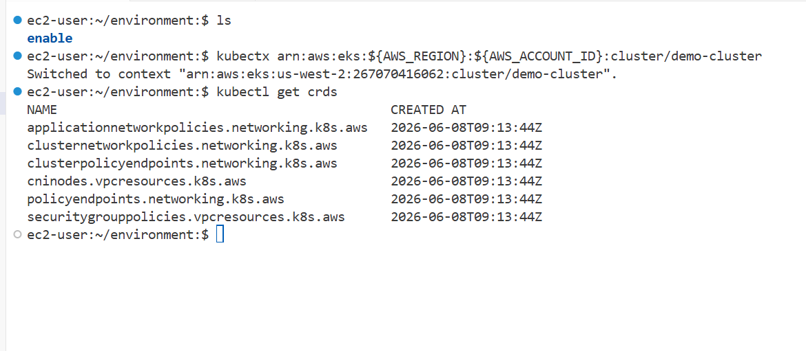

kubectl wait --for=condition=available deployment --all
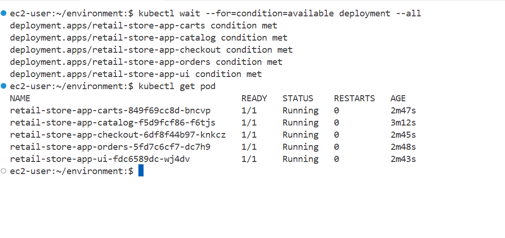

kubectl get svc
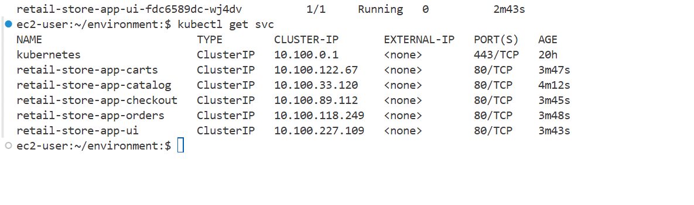

kubectl port-forward pod/podname <localport>:<container-port>
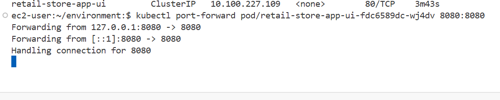

https://d222vzusebo6w5.cloudfront.net/proxy/8080/
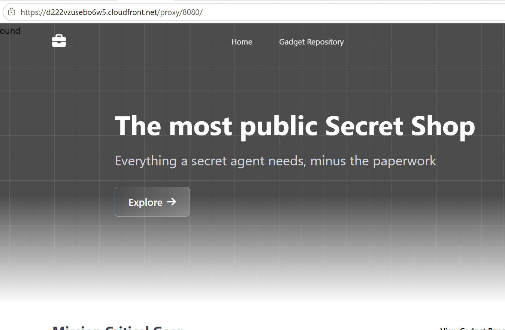

kubectl get nodepool
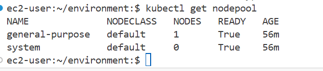
from the console side
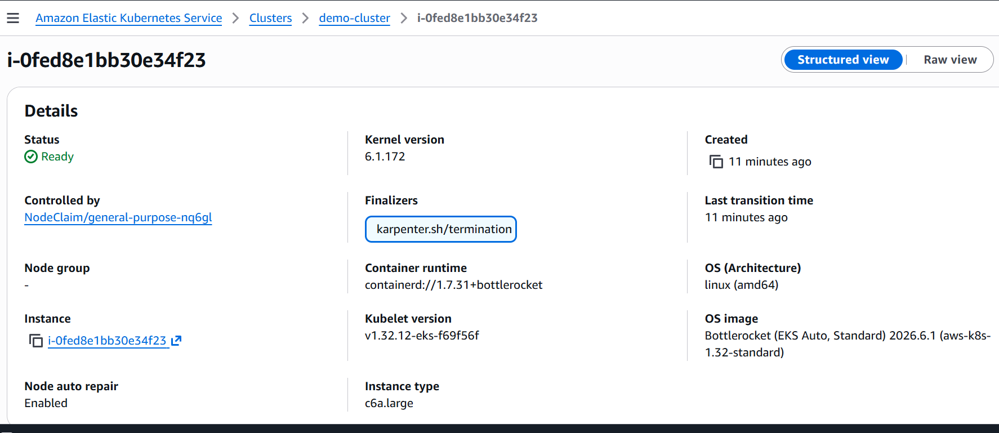
using cli command
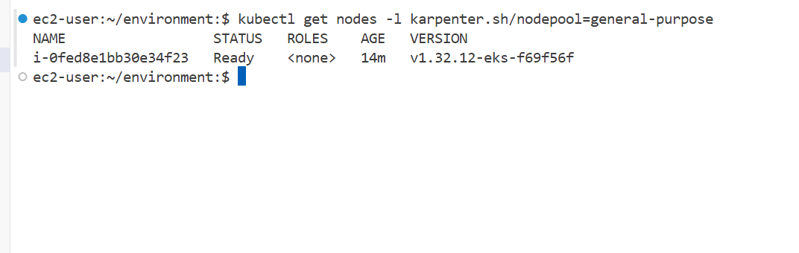

for node in $(kubectl get nodes -l karpenter.sh/nodepool=general-purpose -o custom-columns=NAME:.metadata.name --no-headers); do
  echo "Pods on $node:"
  kubectl get pods --all-namespaces --field-selector spec.nodeName=$node
done
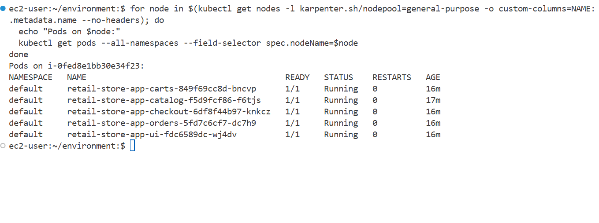

kubectl scale --replicas=12 deployment/retail-store-app-ui
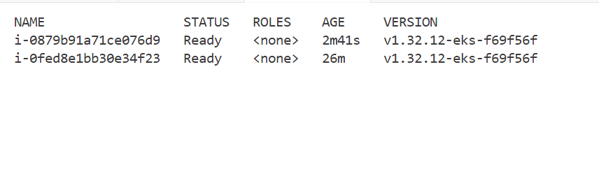

kubectl get pod
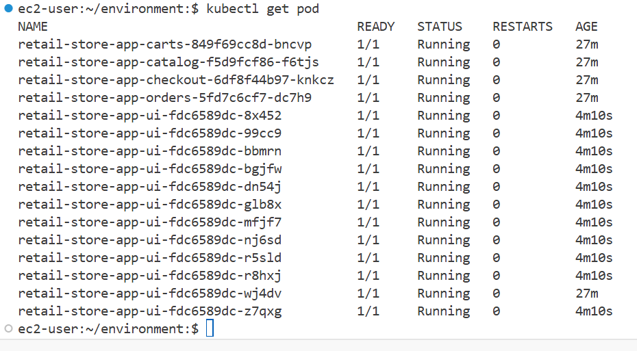
upgraded the helm
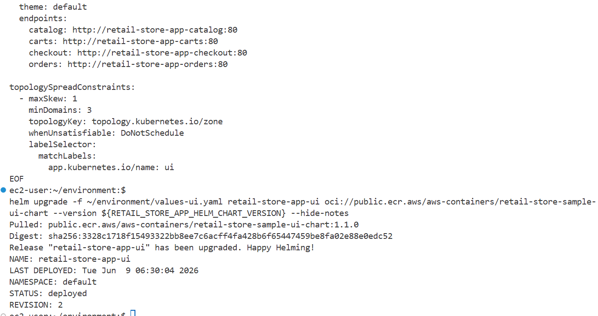

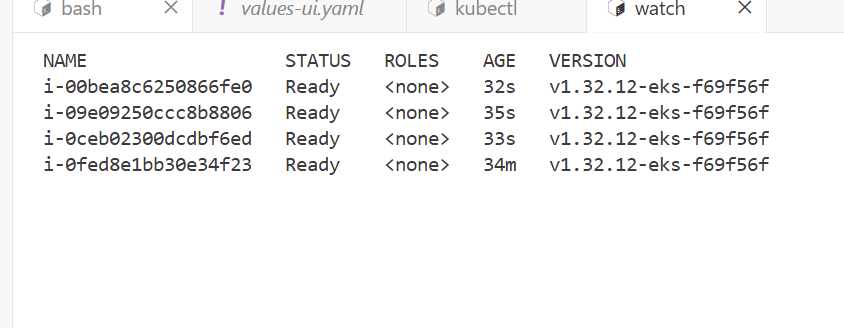

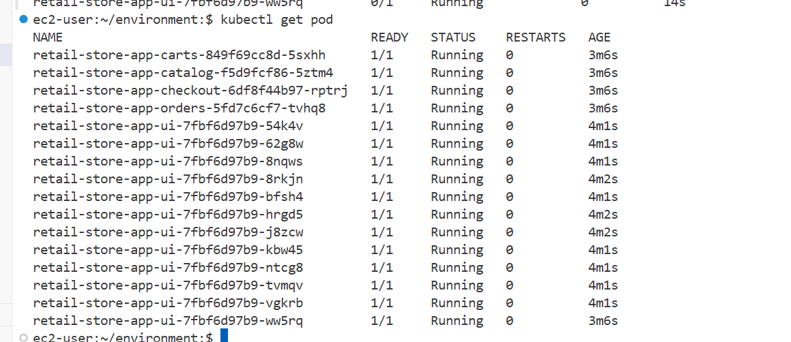

kubectl get node -L topology.kubernetes.io/zone --no-headers | while read node status roles age version zone; do
echo "Pods on node $node (Zone: $zone):"
  kubectl get pods --all-namespaces --field-selector spec.nodeName=$node -l app.kubernetes.io/instance=retail-store-app-ui
echo "-----------------------------------"
done

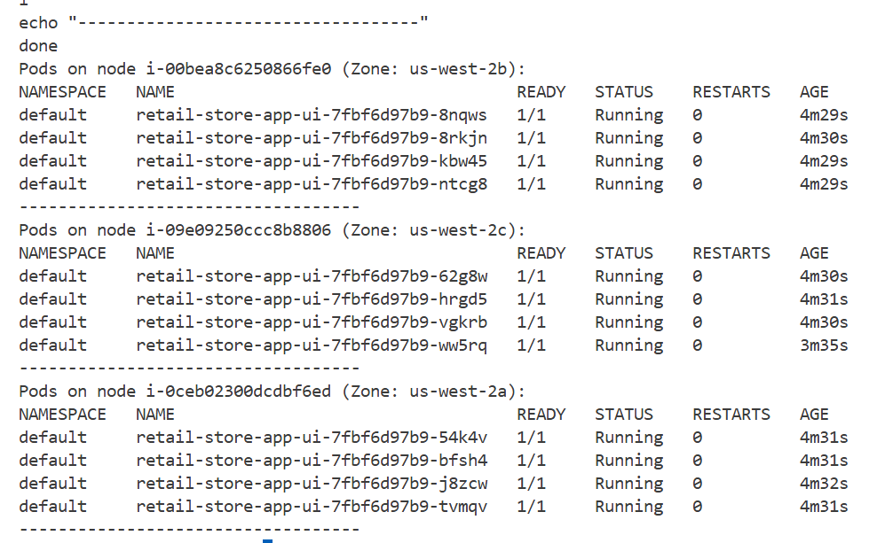

eksctl create addon --name metrics-server --cluster ${DEMO_CLUSTER_NAME}
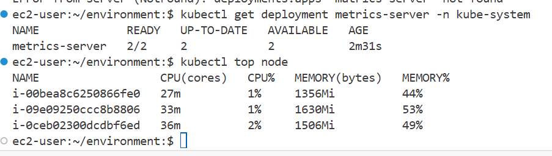

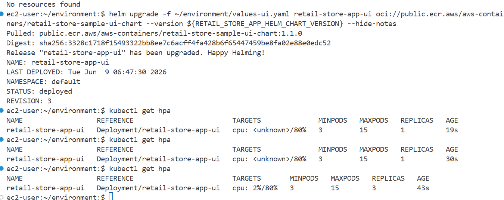

kubectl run load-generator \
 --image=williamyeh/hey:latest \
 --restart=Never -- -c 10 -q 10 -z 4m http://retail-store-app-ui/utility/stress/200000
 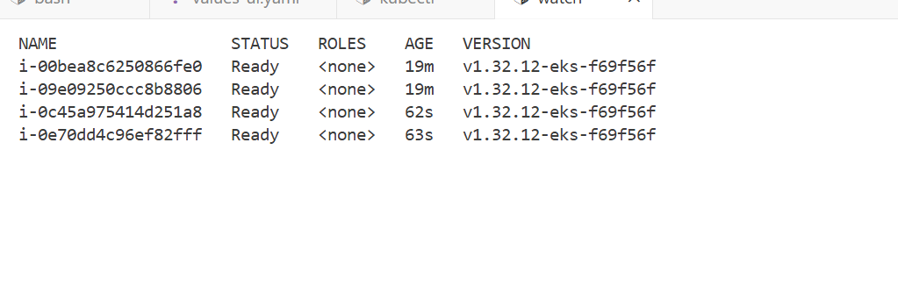

 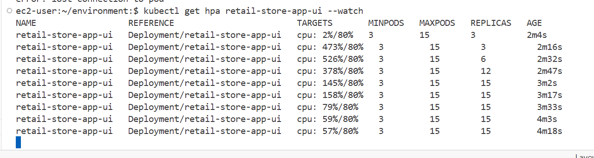

 