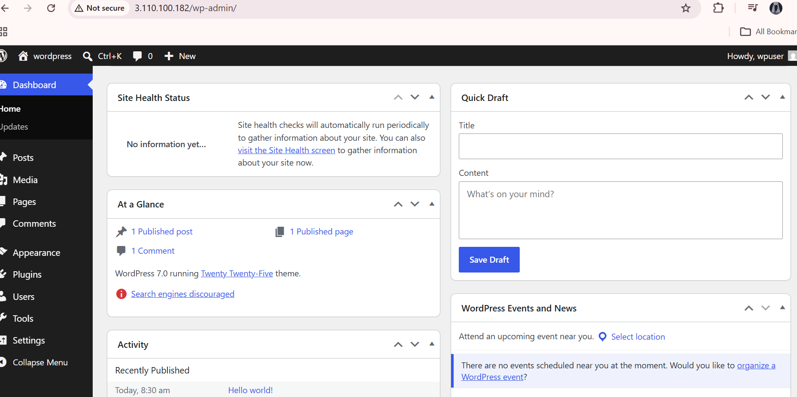

# WordPress Setup on Amazon Linux 2023 EC2

## Environment Details

```bash
NAME="Amazon Linux"
VERSION="2023"
PRETTY_NAME="Amazon Linux 2023"
```

---

# 1. Update the Server

```bash
sudo dnf update -y
```

Verify OS Version:

```bash
cat /etc/os-release
```

---

# 2. Install Nginx

```bash
sudo dnf install nginx -y
```

Enable and Start Nginx:

```bash
sudo systemctl enable nginx
sudo systemctl start nginx
```

Verify Status:

```bash
sudo systemctl status nginx
```

Verify Port 80:

```bash
sudo ss -tulpn | grep :80
```

---

# 3. Install PHP and Required Extensions

```bash
sudo dnf install -y \
php \
php-fpm \
php-mysqlnd \
php-gd \
php-mbstring \
php-xml \
php-curl \
php-zip
```

Verify PHP:

```bash
php -v
```

Verify PHP Modules:

```bash
php -m
```

---

# 4. Start PHP-FPM

```bash
sudo systemctl enable php-fpm
sudo systemctl start php-fpm
```

Check Status:

```bash
sudo systemctl status php-fpm
```

---

# 5. Install Database Server

## Option A - MariaDB (Recommended)

```bash
sudo dnf install mariadb105-server -y
```

Start Service:

```bash
sudo systemctl enable mariadb
sudo systemctl start mariadb
```

Verify:

```bash
sudo systemctl status mariadb
```

---

# 6. Download WordPress

```bash
cd /tmp

wget https://wordpress.org/latest.tar.gz

tar -xzf latest.tar.gz
```

Copy Files:

```bash
sudo cp -r wordpress/* /usr/share/nginx/html/
```

---

# 7. Verify WordPress Files

```bash
ls -la /usr/share/nginx/html
```

Expected Files:

```text
wp-admin
wp-content
wp-includes
index.php
wp-config-sample.php
```

---

# 8. Configure File Permissions

```bash
sudo chown -R nginx:nginx /usr/share/nginx/html

sudo chmod -R 755 /usr/share/nginx/html
```

---

# 9. Nginx Warning Encountered

Warning:

```text
conflicting server name "_" on 0.0.0.0:80
```

Verify Configuration:

```bash
sudo nginx -t
```

Result:

```text
syntax is ok
test is successful
```

---

# 10. Issue Found

Accessing:

```bash
curl http://localhost
```

Returned:

```html
Welcome to nginx!
```

This indicated that Nginx was serving the default page instead of WordPress.

---

# 11. Remove Default Nginx Page

Rename Default Index:

```bash
sudo mv /usr/share/nginx/html/index.html \
/usr/share/nginx/html/index.html.bak
```

Restart Nginx:

```bash
sudo systemctl restart nginx
```

---

# 12. Create WordPress Database

Login:

```bash
sudo mysql
```

Create Database and User:

```sql
CREATE DATABASE wordpress;

CREATE USER 'wpuser'@'localhost'
IDENTIFIED BY 'Password@123';

GRANT ALL PRIVILEGES
ON wordpress.*
TO 'wpuser'@'localhost';

FLUSH PRIVILEGES;

EXIT;
```

---

# 13. Create wp-config.php

Move to WordPress Directory:

```bash
cd /usr/share/nginx/html
```

Create Config:

```bash
cp wp-config-sample.php wp-config.php
```

Verify:

```bash
ls -l wp-config.php
```

---

# 14. Configure Database Settings

Edit:

```bash
vi wp-config.php
```

Update:

```php
define('DB_NAME', 'wordpress');
define('DB_USER', 'wpuser');
define('DB_PASSWORD', 'Password@123');
define('DB_HOST', 'localhost');
```

---

# 15. Verify PHP Processing

Create Test File:

```bash
echo "<?php phpinfo(); ?>" \
| sudo tee /usr/share/nginx/html/test.php
```

Open:

```text
http://<EC2-PUBLIC-IP>/test.php
```

Expected:

```text
PHP Information Page
```

---

# 16. Configure Nginx for PHP

Example Configuration:

```nginx
server {
    listen 80;
    server_name _;

    root /usr/share/nginx/html;
    index index.php index.html;

    location / {
        try_files $uri $uri/ /index.php?$args;
    }

    location ~ \.php$ {
        include fastcgi_params;
        fastcgi_pass unix:/run/php-fpm/www.sock;
        fastcgi_param SCRIPT_FILENAME $document_root$fastcgi_script_name;
    }
}
```

Validate:

```bash
sudo nginx -t
```

Reload:

```bash
sudo systemctl reload nginx
```

---

# 17. AWS Security Group Rules

Open:

| Type  | Port |
| ----- | ---- |
| SSH   | 22   |
| HTTP  | 80   |
| HTTPS | 443  |

---

# 18. Access WordPress

Get Public IP:

```bash
curl ifconfig.me
```

Open Browser:

```text
http://<PUBLIC-IP>
```

Expected:

```text
WordPress Installation Wizard
```

---

# 19. Troubleshooting Commands

Check Nginx:

```bash
sudo systemctl status nginx
```

Check PHP-FPM:

```bash
sudo systemctl status php-fpm
```

Check Database:

```bash
sudo systemctl status mariadb
```

Check Listening Ports:

```bash
sudo ss -tulpn
```

Check Nginx Errors:

```bash
sudo tail -50 /var/log/nginx/error.log
```

Check PHP Logs:

```bash
sudo journalctl -u php-fpm -n 50
```

---

# Current Status

* Amazon Linux 2023 installed.
* Nginx installed and running.
* WordPress files copied successfully.
* `wp-config.php` was initially missing.
* Default Nginx page was being served.
* Need to verify PHP-FPM, database connectivity, and WordPress configuration to complete setup.

```
```

