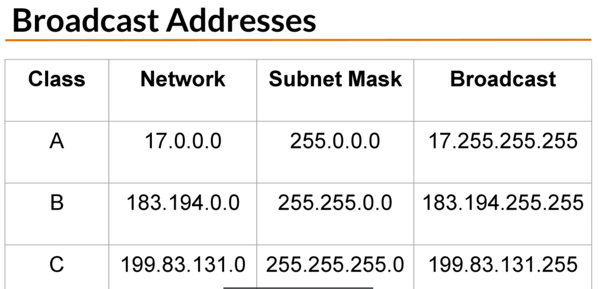
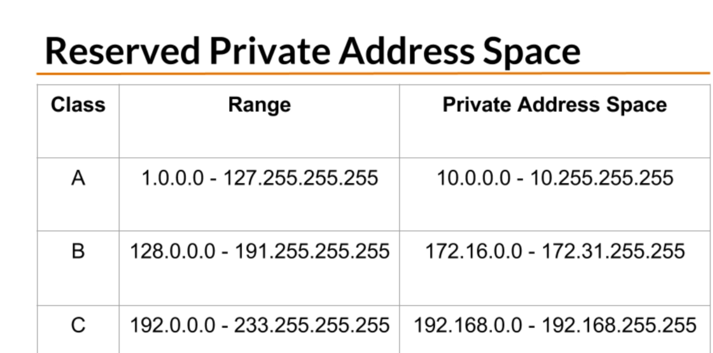
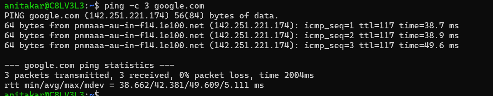
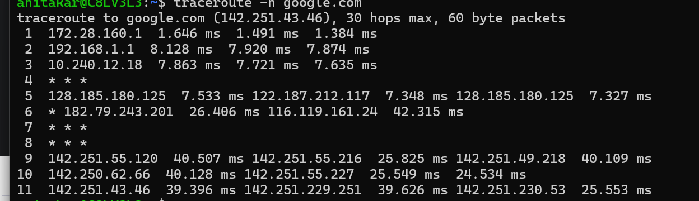
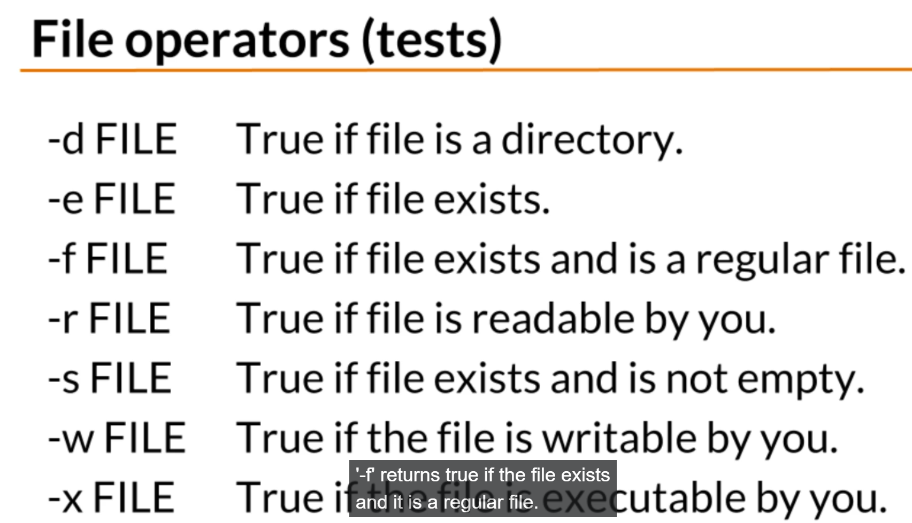
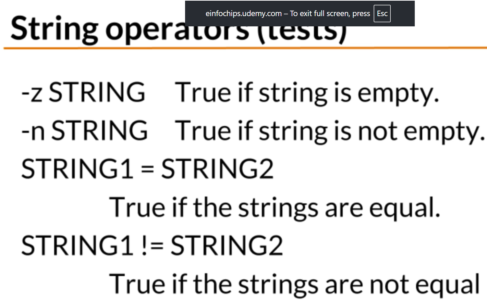
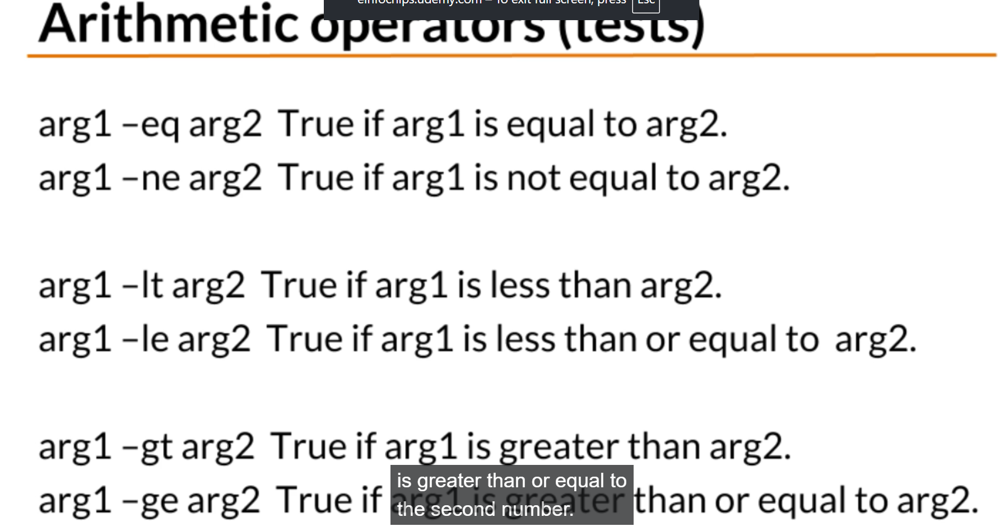

fdisk /dev/sdd

mkfs -t type device 
mkfs -t ext4 /dev/sdb2

LVM summary
lvremove /dev/vg_name/
vg_reduce vg_name /dev/sdb
vg_remove vg_name 
pvremove /dev/sdb

# LVM (Logical Volume Manager) in Linux

LVM is a storage management layer in Linux that provides flexibility in managing disk space compared to traditional partitions.

Instead of creating fixed partitions directly on disks, LVM allows you to create logical volumes that can be resized dynamically.

-----------------
# IP Address

# Network traffic
ping - test connectivity with ping 

rtt -round trip time

tracroute - convert ip into DNS 

# Variables
storage location that have a name
syntax 
VARIABLE_NAME="value"
variables are case sensetive 
By convention variables are uppercase

 String operation
 

# arthematic operatior 
 

 # Reuse the last item of a command 
  

 